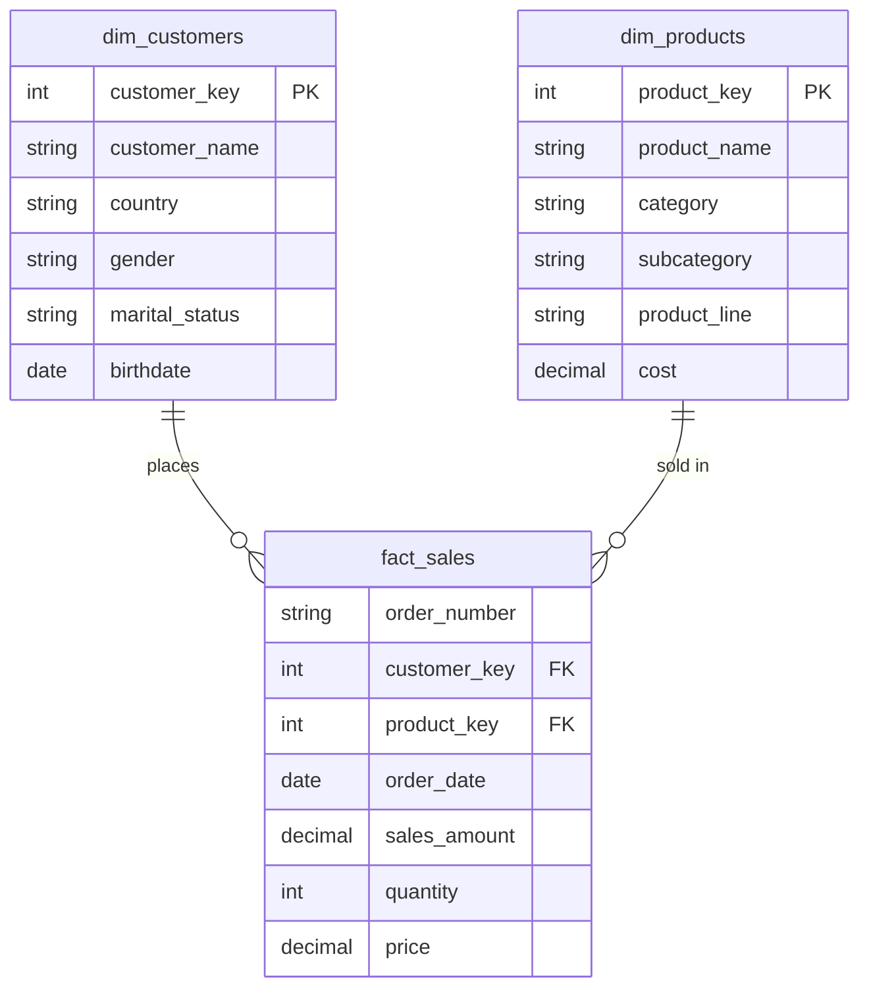

# 📊 MySQL Sales Exploratory Data Analysis


A structured, SQL-only exploratory data analysis of a customer / product / sales dataset in **MySQL**. The project moves from database exploration through data quality checks, dimension and date profiling, core business measures, magnitude comparisons, and top/bottom ranking — turning raw relational tables into clear, query-driven business insights.

---

## 📑 Table of Contents

- [Overview](#-overview)
- [Dataset Structure](#-dataset-structure)
- [Objectives](#-objectives)
- [EDA Process](#-eda-process)
- [Repository Structure](#-repository-structure)
- [SQL Skills Applied](#-sql-skills-applied)
- [Sample Query](#-sample-query)
- [Key Findings](#-key-findings)
- [Getting Started](#-getting-started)
- [Future Improvements](#-future-improvements)
- [Author](#-author)

---

## 🧭 Overview

This project analyzes sales-related data using **MySQL 8.x**, working across three core tables — customers, products, and sales transactions. The goal was not to build dashboards or predictive models, but to thoroughly **explore, validate, and understand** the dataset through SQL before any further analysis is built on top of it.

The analysis covers customer characteristics, product structure, sales measures, geographical performance, time-based activity, and rankings — using only native SQL, executed and validated in MySQL Workbench.

## 🗂 Dataset Structure

The project uses a simple dimensional (star-schema-style) structure: two dimension tables and one fact table.



| Table | Description |
|---|---|
| `dim_customers` | Customer details — name, country, gender, marital status, birthdate |
| `dim_products` | Product details — category, subcategory, product line, cost |
| `fact_sales` | Transaction-level records — order number, keys, dates, sales amount, quantity, price |

## 🎯 Objectives

- Understand the structure of the database
- Examine the quality and completeness of the data
- Explore important customer and product dimensions
- Identify the time period covered by the sales records
- Calculate the main business measures
- Compare sales performance across different groups
- Identify high-performing and low-performing entities
- Present findings in a clear, understandable form
- Practice core and intermediate SQL concepts in a real analysis scenario

## 🔄 EDA Process

The analysis follows seven sequential stages:


| # | Stage | Focus |
|---|---|---|
| 1 | **Database Exploration** | Tables, columns, data types, row counts |
| 2 | **Data Quality Checks** | Duplicates, nulls, invalid values, orphaned keys |
| 3 | **Dimensions Exploration** | Distinct customer & product categories |
| 4 | **Date Exploration** | Sales date range, customer age range |
| 5 | **Measures Exploration** | Revenue, quantity, price, order & customer counts |
| 6 | **Magnitude Analysis** | Measures broken down by country, category, gender, customer |
| 7 | **Ranking Analysis** | Top/bottom products and customers via `LIMIT` and `DENSE_RANK()` |

> A diagram of this process (`EDA_Process_Diagram.png`) is included in the repo and can be embedded here, e.g. ``.

## 📁 Repository Structure

Suggested layout — adjust file/folder names to match your actual repository:

```
mysql-sales-eda/
├── README.md
├── scripts/
│   ├── 01_database_exploration.sql
│   ├── 02_data_quality_checks.sql
│   ├── 03_dimensions_exploration.sql
│   ├── 04_date_exploration.sql
│   ├── 05_measures_exploration.sql
│   ├── 06_magnitude_analysis.sql
│   └── 07_ranking_analysis.sql

└── LICENSE
```

## 🛠 SQL Skills Applied

`SELECT` · `DISTINCT` · `WHERE` · `ORDER BY` · `GROUP BY` · `HAVING` · Aggregate functions · `INNER JOIN` · `LEFT JOIN` · `UNION ALL` · Common Table Expressions · Window functions (`DENSE_RANK()`) · Conditional logic (`CASE`) · Date functions (`CURDATE()`, `TIMESTAMPDIFF()`) · Null handling · Top/bottom ranking · Database metadata exploration

The project also involved translating SQL Server-style patterns into valid MySQL syntax — e.g. using `LIMIT`, `CURDATE()`, and `TIMESTAMPDIFF()` in place of SQL Server-specific equivalents.

```

## 📈 Key Findings

> Replace the placeholders below with the actual output of your final queries before publishing.

- Total sales revenue: **[total revenue]**, from **[total orders]** unique orders
- **[country]** generated the highest revenue; **[category]** was the top-performing category
- Top customer by revenue: **[customer key]**, with **[value]** in total sales
- Best-selling product by revenue: **[product name]**
- Sales data spans **[first order date]** to **[last order date]** (~**[number]** months)
- Data quality checks found **[number]** duplicate keys and **[number]** unmatched records

For the full write-up, see the [project report](docs/MySQL_Sales_EDA_Project_Report.docx).

## 👤 Author

**Muhammad Usman**
Computer Science student · Data Analytics enthusiast

---

⭐ If you found this project useful, consider giving it a star!
